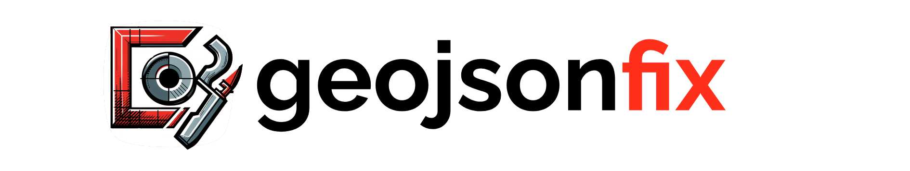

**Validates and automatically fixes invalid GeoJSON - 🌎 Webapp and 🐍 Python package.** 

The only tool that addresses all potential issues:
- **Invalid** according to GeoJSON specification: e.g. duplicate nodes, wrong winding order, unclosed 
- **Problematic** with some tools & APIs: e.g. self-intersection, holes, crossing anti-meridian


<h3 align="center">
    🎈 <a href="https://geojsonfix.streamlit.app/">Try it out here: geojsonfix webapp 🎈 </a>
</h3>

<br>

## Python package

### Installation
```bash
pip install geojsonfix
```

### Usage

As input takes any GeoJSON (dictionary, filepath, url), shapely geometry or anything with a __geo_interface__.

```python
import geojsonfix

geojson = {'type': 'FeatureCollection',
           'features': [{'type': 'Feature', 'geometry':
             {'type': 'Polygon', 'coordinates': [[[-59.758285, 8.367035], ...]]}}]}

geojsonfix.validate(geojson)
```
The result gives the reason and positional index of the invalid geometry.
```json
{"invalid": {"duplicate_nodes": [2]},
 "problematic": {"self_intersection": [0, 2], "crosses_antimeridian": [1]},
 "count_geometry_types": {"Polygon": 2, "MultiPolygon": 1}}
```

<br>

### Parameters
It is possible to select only specific validation criteria. For comprehensive criteria descriptions,
see the [geojson-invalid-geometry](https://github.com/chrieke/geojson-invalid-geometry) list.

```python
# Invalid according to the GeoJSON specification
criteria_invalid = ["unclosed", "duplicate_nodes", "less_three_unique_nodes", "exterior_not_ccw", 
                    "interior_not_cw", "inner_and_exterior_ring_intersect", "crs_defined", 
                    "outside_lat_lon_boundaries"]

# Problematic with some tools & APIs
criteria_problematic = ["holes", "self_intersection", "excessive_coordinate_precision", 
                        "more_than_2d_coordinates", "crosses_antimeridian"]

geojsonfix.validate(geojson, criteria_invalid, criteria_problematic)
```

<br>
<br>

## TODO:
- Automatically fix geometries
- Accept all Geometry types, validate/fix depending on type
- Check for incorrect geometry data type in type vs. geometry pattern
- bbox order and other criteria
- Multihtreading?

No:
- Filsupport wkt etc. that would require more dependencies.