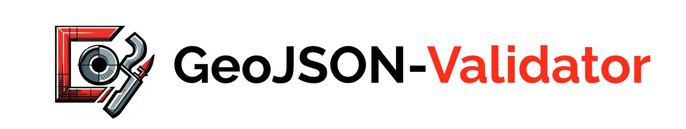

# GeoJSON Validator



**Validate GeoJSON and automatically fix invalid geometries**. Like *geojsonhint*, but with geometry checks & fixes!

- 🔴 **Detects invalid geometries** & 🟢 **fixes them** : *Unclosed, wrong winding order etc.* 
- 🟨 **Problematic** geometries (for many tools & APIs): *Self-intersection, crossing anti-meridian etc.*
- Checks 🧬 **structure** according to GeoJSON specification
- Use **Website** or **Python package**

<br>

<h3 align="center">
    🎈 <a href="https://geojson-validator.streamlit.app/">geojson-validator.streamlit.app in the Browser 🎈 </a>
</h3>

<br>

Also see the 
[geojson-invalid-geometry](https://github.com/chrieke/geojson-invalid-geometry) list for detailed explanations of all possible GeoJSON issues.

### Quickstart Python

```bash
# Installation
pip install geojson-validator
```

Data input can be any type of GeoJSON object, a filepath/url, and anything with a `__geo_interface__` (shapely, geopandas etc.).

```python
import geojson_validator

geojson_input = {'type': 'FeatureCollection',
                 'features': [{'type': 'Feature', 'geometry':
                     {'type': 'Point', 'coordinates': [-59.758285, 8.367035]}}]}

geojson_validator.validate_structure(geojson_input)
geojson_validator.validate_geometries(geojson_input)
geojson_validator.fix_geometries(geojson_input)
```
<br>

### 1. Validate GeoJSON structure 🧬

Checks the structure & formatting of the GeoJSON, e.g. required elements, data & geometry types, coordinate array depth etc.

```python
geojson_validator.validate_structure(geojson_input, check_crs=False)
```

Returns the reasons why the input does not conform to the GeoJSON specification.
Also gives the JSON path and feature index to more quickly localize the issues. 
Example: `{"Missing 'type' member": {"path": ["/features/0"], "feature": [0]}}`.


### 2. Validate geometries 🟥

Checks the GeoJSON geometry objects for inconsistencies and geometric issues. See 
[geojson-invalid-geometry](https://github.com/chrieke/geojson-invalid-geometry) for a detailed description of all 
invalid and problematic criteria. You can choose to validate only specific criteria, by default all are selected.

```python
# Invalid according to the GeoJSON specification
criteria_invalid = ["unclosed", "less_three_unique_nodes", "exterior_not_ccw",
                    "interior_not_cw"]

# Problematic with some tools & APIs
criteria_problematic = ["holes", "inner_and_exterior_ring_intersect", "self_intersection",
                        "duplicate_nodes", "excessive_coordinate_precision", "excessive_vertices",
                        "3d_coordinates", "outside_lat_lon_boundaries", "crosses_antimeridian"]

geojson_validator.validate_geometries(geojson, criteria_invalid, criteria_problematic)
```
Returns the reasons (example below) and positional indices of the invalid geometries, e.g. features `[0, 3]`. Also indicates if a 
sub-geometry of a MultiType geometry make it invalid e.g. `{2:[0, 5]}`.

```
{"invalid":
     {"unclosed": [0, 3],
      "exterior_not_ccw": [{2: [0, 5]}]},
 "problematic":
     {"crosses_antimeridian": [1]},
 "count_geometry_types":
     {"Polygon": 3,
      "MultiPolygon": 1},
 "skipped_validation": []}
```

`skipped_validation` lists the indices of features that could not be checked, e.g. a null
geometry, an unsupported geometry type, or a geometry whose structure is broken. Use
`validate_structure` to find out what is wrong with those. A MultiType geometry is listed
if any of its sub-geometries could not be checked, so it can appear both here and under a
violated criterium.


### 3. Fix GeoJSON geometries 🟩

Automatically repairs some of the most common categories of invalid geometries. 
Always fixes *["unclosed", "exterior_not_ccw", "interior_not_cw"]*.
Select additional, non-essential fixes with the parameter `optional`.
Currently only Polygon geometries are fixed, other geometry types are left unchanged.


```python
geojson_validator.fix_geometries(geojson_input, optional=["duplicate_nodes"])
```

The result is a GeoJSON FeatureCollection with the fixed geometries.


### FAQ:
- Why not use geojson-pydantic for the structure validation? Its error messages are
  schema-shaped and hard to act on: a single missing coordinate is reported four times, and
  the wording usually has to be translated before it can be shown to a non-programmer.
  This library reports each problem once, in plain language, with the JSON path and feature
  index.
- Too many logging messages, can I disable them? You can disable or configure the logging behavior via `geojson_validator.configure_logging(enabled=True, level="DEBUG")` which also returns the logger instance.
- Does it ship type hints? Yes, the package is [PEP 561](https://peps.python.org/pep-0561/) typed, so mypy/pyright pick up the annotations without extra stubs.
